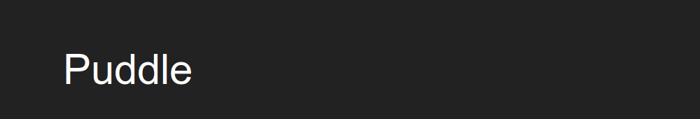
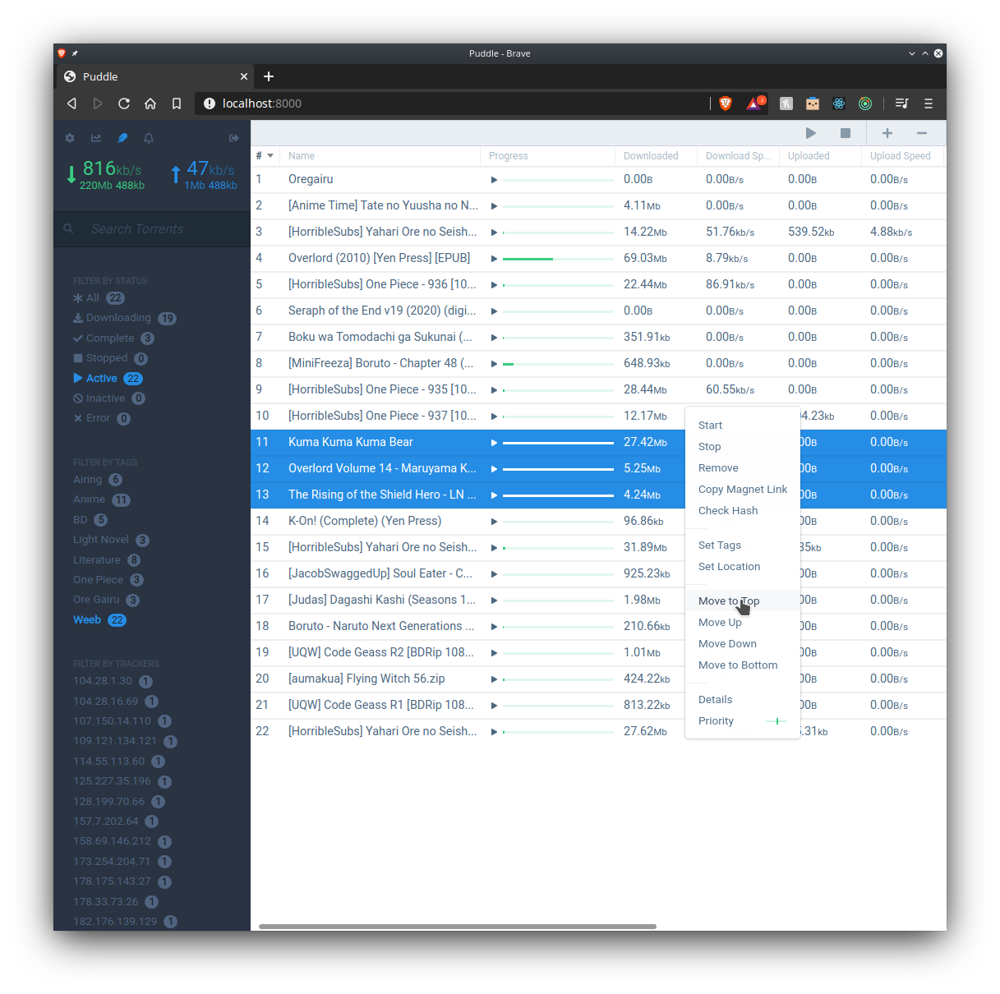
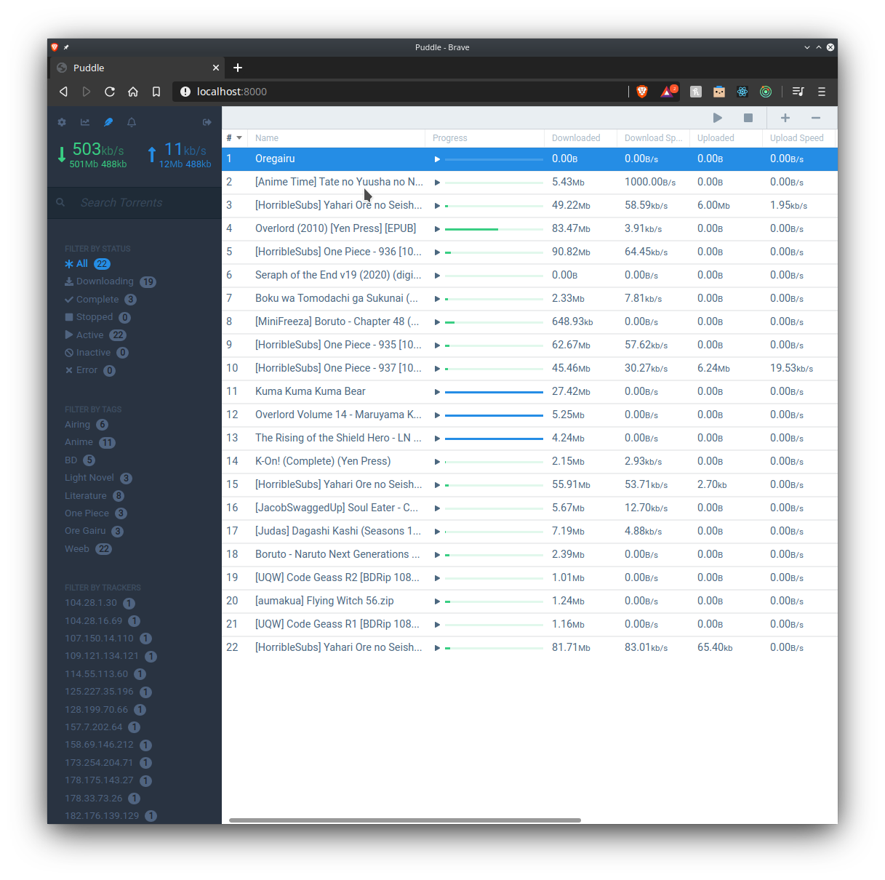
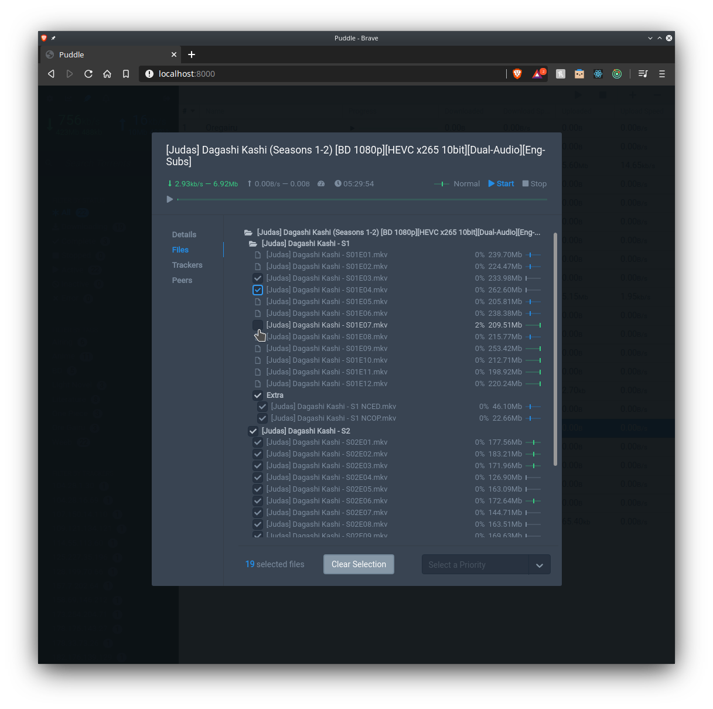
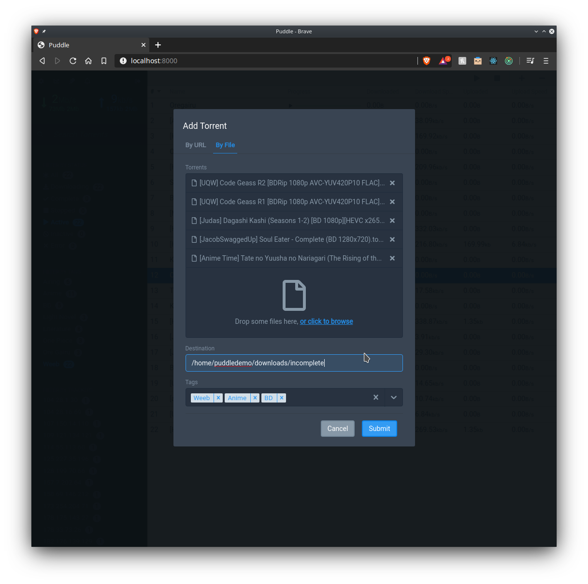
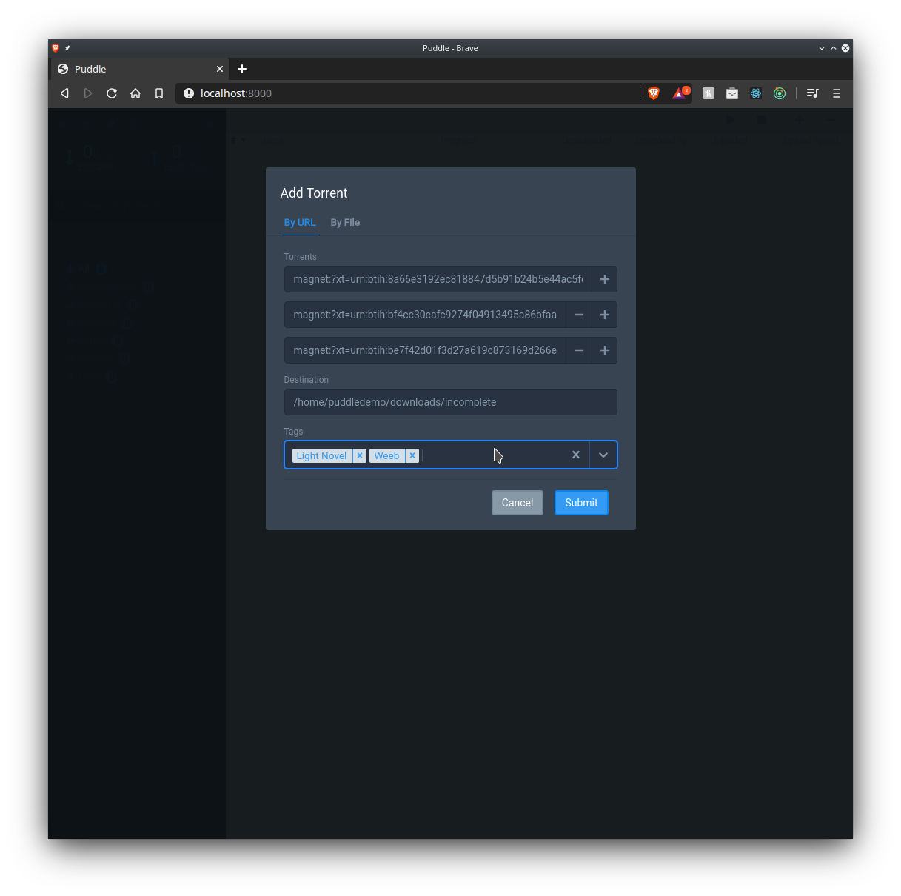
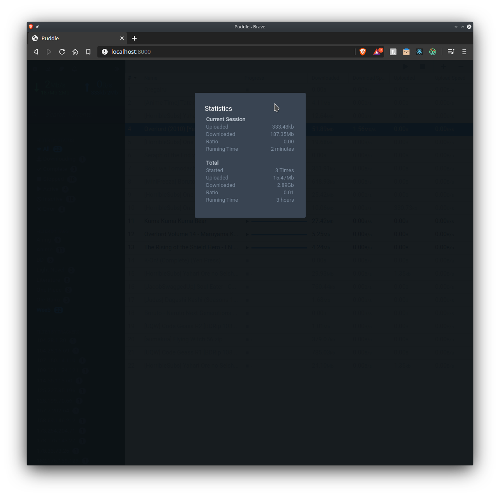
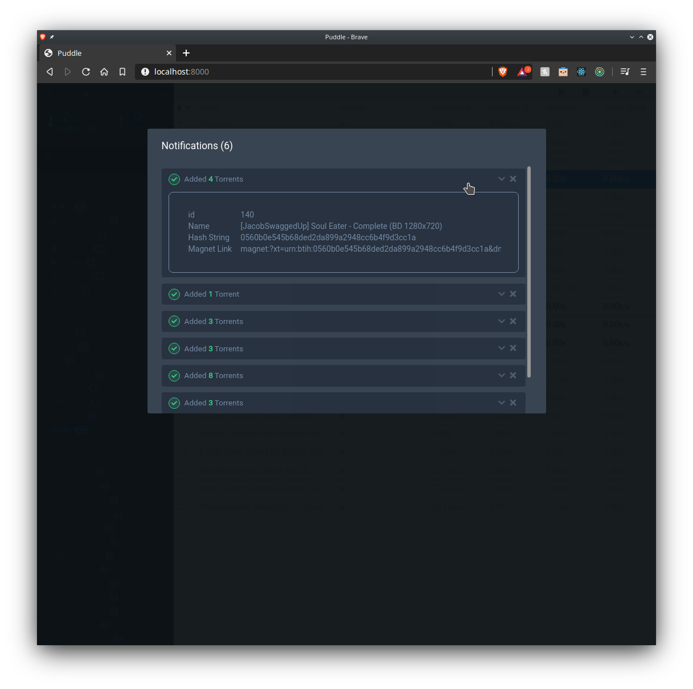

<p>
  <a href="https://github.com/mohkale/puddle">
    
  </a>
</p>

<div>
  <!-- TODO add puddle logo here -->

  <div align="right">
    <a href="https://github.com/mohkale/puddle/actions?query=workflow%3Abuild">
      
    </a>
    <a href="https://github.com/mohkale/puddle/actions?query=workflow%3Atests">
      
    </a>
    <a href="https://mohkale.github.io/puddle/">
      
    </a>
    <a href="https://opensource.org/licenses/MIT">
      
    </a>
    <a href="https://github.com/mohkale/puddle/releases">
      
    </a>
  </div>
</div>

<p></p>

A [flood][flood] like [react][react] based frontend for the [transmission][trans]
bittorrent daemon.

<div style="display: flex; justify-content: center;">
  <a href="./.github/images/dashboard2.png" target="_blank">
    
  </a>
</div>

[flood]: https://github.com/Flood-UI/flood
[react]: https://reactjs.org/
[trans]: https://github.com/transmission/transmission

<!-- markdown-toc start - Don't edit this section. Run M-x markdown-toc-refresh-toc -->
**Table of Contents**
---

- [Puddle](#puddle)
  - [Requirements](#requirements)
  - [Instructions](#instructions)
  - [Configuration](#configuration)
  - [Credits](#credits)
  - [Screenshots](#screenshots)
<!-- markdown-toc end -->

## Requirements
- Transmission v3.0 (or higher)
- node v12.0 (or higher)

## Installation
1. setup user configuration (see [configuration](#configuration)).
1. install dependencies `npm i`
2. build puddle `npm build:production`
3. start server `npm serve:production`

## Configuration
Puddle is configured using a simple typescript [file](./config.template.ts) at
`./config.ts`. You have two options for how to start customization.

You can either copy `config.template.ts` to `config.ts` and start altering the
default fields to your liking. Or you can create a new config file and overwrite
the default fields:

```typescript
import { config as defaultConfig, Config } from './config';

export const config: Config = Object.assign(defaultConfig, {
  ...extraOptions
})
```

The first approach is recommended because it results in smaller bundles, although
the second approach avoids any issues if the configuration format changes across
newer puddle versions.

For a list of available configuration fields, see the
[docs](https://mohkale.github.io/puddle/Config.html).

## Credits
puddle takes heavy inspirations from:
- [flood][flood]
- [tremc](https://github.com/tremc/tremc)
- [react-transmission](https://github.com/fcsonline/react-transmission)
- [transmission-web](https://github.com/transmission/transmission/tree/master/web)

## Screenshots
<table>
  <tbody>
    <tr style="background-color: transparent; border: 0px;">
      <td style="border: 0px">
        <a href="./.github/images/dashboard.png" target="_blank">
          
        </a>
        <h3 style="text-align: center; margin: 0px;">Dashboard</h3>
      </td>
      <td style="border: 0px">
        <a href="./.github/images/torrent-details.png" target="_blank">
          
        </a>
        <h3 style="text-align: center; margin: 0px;">Torrent Files</h3>
      </td>
    </tr>
    <tr style="background-color: transparent; border: 0px;">
      <td style="border: 0px">
        <a href="./.github/images/add-by-file.png" target="_blank">
          
        </a>
        <h3 style="text-align: center; margin: 0px;">Add torrents from files</h3>
      </td>
      <td style="border: 0px">
        <a href="./.github/images/add-by-url.png" target="_blank">
          
        </a>
        <h3 style="text-align: center; margin: 0px;">Add torrents from Magnet Links</h3>
      </td>
    </tr>
    <tr style="background-color: transparent; border: 0px;">
      <td style="border: 0px">
        <a href="./.github/images/statistics.png" target="_blank">
          
        </a>
        <h3 style="text-align: center; margin: 0px;">Statistics</h3>
      </td>
      <td style="border: 0px">
        <a href="./.github/images/add-by-url.png" target="_blank">
          
        </a>
        <h3 style="text-align: center; margin: 0px;">Notifications</h3>
      </td>
    </tr>
  </tbody>
</table>
